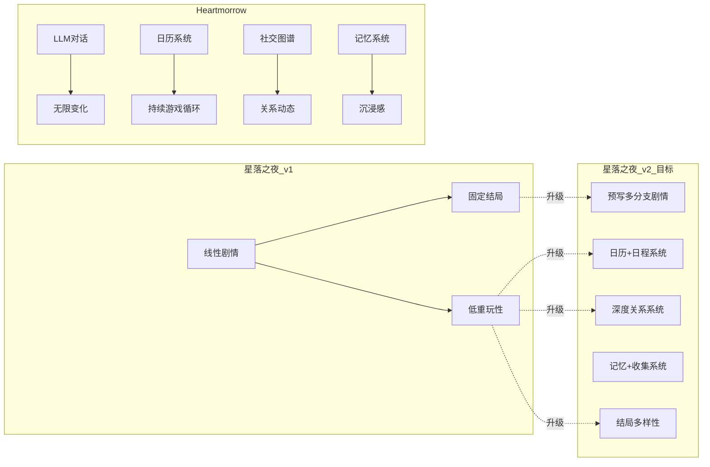

# 星落之夜 vs Heartmorrow — 差距分析

> 产品部 · 市场研究员 · 竞品分析
> 日期：2026-07-30

---

## 一、项目基础信息对比

| 维度 | 星落之夜 v1.0 | Heartmorrow |
|:-----|:---------------|:------------|
| **类型** | 固定分支视觉小说 | 无限重玩恋爱+世界模拟器 |
| **技术栈** | 单 HTML 文件（32KB） | monorepo（shared + server + web） |
| **依赖** | 零依赖 | Node.js + pnpm + LLM 服务器 |
| **安装** | 浏览器打开即玩 | 需要本地服务器 + LLM |
| **部署** | GitHub Pages | 本地运行 |
| **语言** | 纯 JavaScript | TypeScript（Zod 验证） |
| **开发时间** | 1 天（AI生成） | 长期迭代项目 |
| **存储** | localStorage | SQLite (node:sqlite) |
| **代码量** | ~32KB 单文件 | ~330K+ 多包 |

## 二、核心玩法对比（7维度）

### 维度 1：剧情与分支

| 星落之夜 | Heartmorrow |
|:---------|:------------|
| 线性预设分支（选择→固定结果） | LLM 实时生成对话 |
| ~150 句预设对话 | 无限生成对话 |
| 4 个选择点，2 个结局变体 | 无固定结局 |
| 读完即完，无重玩价值 | 每次对话不同，无限重玩 |
| 剧情数据在 JS 中写死 | 剧情由 LLM + 规则引擎共同生成 |

**差距等级：** 🔴 核心差距

### 维度 2：角色系统

| 星落之夜 | Heartmorrow |
|:---------|:------------|
| 4 个角色（含旁白） | 任意数量可创作角色 |
| Emoji 头像 + 颜色 | 自定义肖像 + 表情变体 |
| 3 维好感度（整数累加） | 7 维关系系统（0-100） |
| 好感度仅显示数字 | 好感度→温暖度→6 阶段关系 |
| 全固定预设 | 每个人物有性格/喜好/目标/界限 |

**差距等级：** 🔴 核心差距

### 维度 3：游戏循环

| 星落之夜 | Heartmorrow |
|:---------|:------------|
| 打开→看剧情→看完→关闭 | 日历系统（112 天/年） |
| 单次通关 ~10 分钟 | 无限循环，每次不同 |
| 无日程/行动点 | 精力经济（3-4 行动/天） |
| 无重玩性 | 不同角色、不同选择、不同结局 |
| 选择只影响结局文字 | 选择影响关系→社交网→世界 |

**差距等级：** 🔴 核心差距

### 维度 4：社交系统

| 星落之夜 | Heartmorrow |
|:---------|:------------|
| 无 | 完整社交图谱 |
| — | 角色间有朋友/对手/前任关系 |
| — | 八卦传播（NPC 间传递消息） |
| — | 嫉妒系统（伴侣发现出轨） |
| — | 朋友圈社交媒体动态 |
| — | 记忆系统（约会产生记忆被引用） |

**差距等级：** 🔴 缺失

### 维度 5：小游戏与经济活动

| 星落之夜 | Heartmorrow |
|:---------|:------------|
| 无 | 6 种小游戏（记忆配对、节奏游戏等） |
| — | 商店系统（送礼物） |
| — | 工作赚钱系统 |
| — | 可选：房地产/股票/赌场 |

**差距等级：** 🟡 中等差距

### 维度 6：技术架构

| 星落之夜 | Heartmorrow |
|:---------|:------------|
| 单文件，零依赖 | 3 包 monorepo |
| 纯前端 | 前端 + API 服务器 + 数据库 |
| localStorage | SQLite 服务器端存储 |
| 无验证层 | Zod schema 验证所有数据变更 |
| 无类型系统 | 全 TypeScript |

**差距等级：** 🟡 架构层面可简化

### 维度 7：创作工具

| 星落之夜 | Heartmorrow |
|:---------|:------------|
| 无 | 完整角色编辑器 |
| — | AI 辅助生成角色 |
| — | 世界自定义 |
| — | LLM 配置面板 |

**差距等级：** 🟡 中等差距（v2 暂不需要）

## 三、技术可行性评估

### 星落之夜可复用资产
- ✅ UI 设计风格（暗色调视觉小说 UI 质量高）
- ✅ 响应式布局（移动端适配很好）
- ✅ 打字机效果、渐变背景切换
- ✅ 存档系统（localStorage 基础框架）
- ✅ GitHub Pages 部署流水线

### 需新增技术能力
| 功能 | 难度 | 方案（纯前端） |
|:-----|:-----|:---------------|
| 日历/日程系统 | 🟢 easy | 纯 JS 日历实现，无后端 |
| 好感度 7 维系统 | 🟢 easy | 本地扩展 flags 维度 |
| 关系阶段演化 | 🟡 medium | 状态机 + 触发条件 |
| LLM 对话集成 | 🟠 受限 | 需 API Key（CORS 问题） |
| 社交图谱 | 🟡 medium | 邻接表存储，全本地 |
| 记忆系统 | 🟢 easy | localStorage 扩展 |
| 小游戏 | 🟡 medium | 纯 JS Canvas 实现 |
| 商店/经济 | 🟢 easy | 纯前端数学运算 |

### LLM 集成可行性（受限于纯前端）
纯前端直接调 LLM API 会遇到 CORS 和 API Key 暴露问题。**v2.0 决策：不做 LLM 集成。**

替代方案：
1. **多态剧情引擎（v2.0 选型）** — 预写多套对话变体，基于关系值和flag自动匹配，零后端
2. Cloudflare Workers 代理 — 可选项，但引入少量后端，违反零后端原则（延后评估）
3. WebLLM — 浏览器端运行小模型（如 Gemma 2B），不需后端，但推理速度慢（延后评估）

LLM 沙盒模式（可选 API/Ollama）将在 v2.x 路线图中评估，v2.0 不涉及。|

## 四、结论：核心差距图谱

**核心差距一句话：** 星落之夜是"看一个故事"，Heartmorrow 是"活在一个世界"。
**v2.0 战略方向：** 保留零安装优势，补"活的世界"短板，在零后端约束下，用多态内容引擎实现接近 LLM 的对话多样性。
